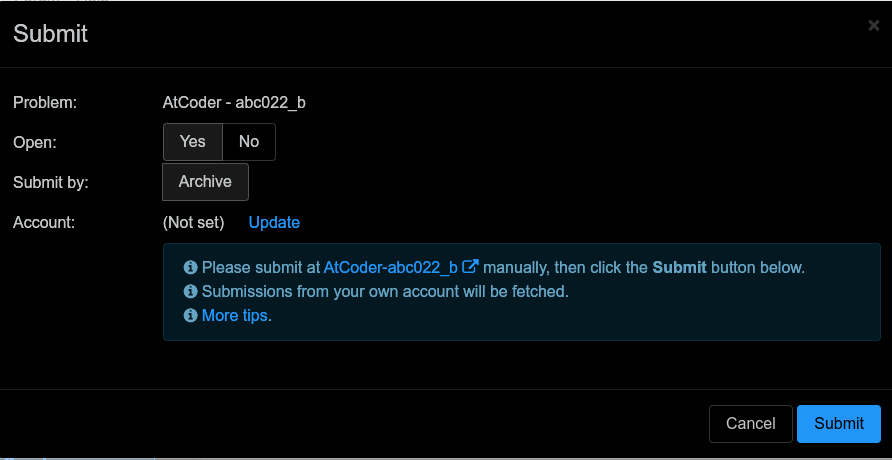
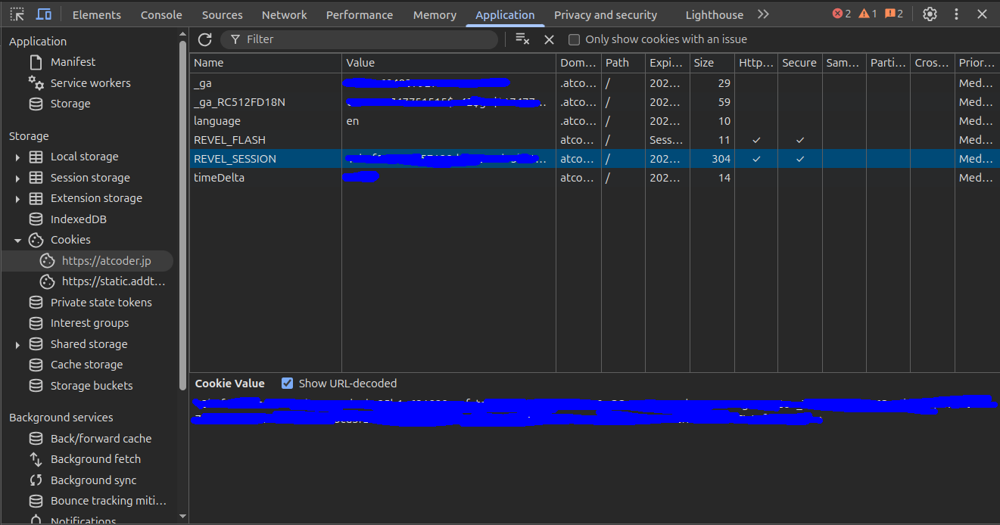
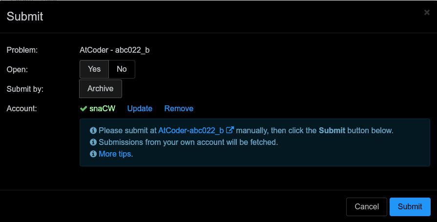
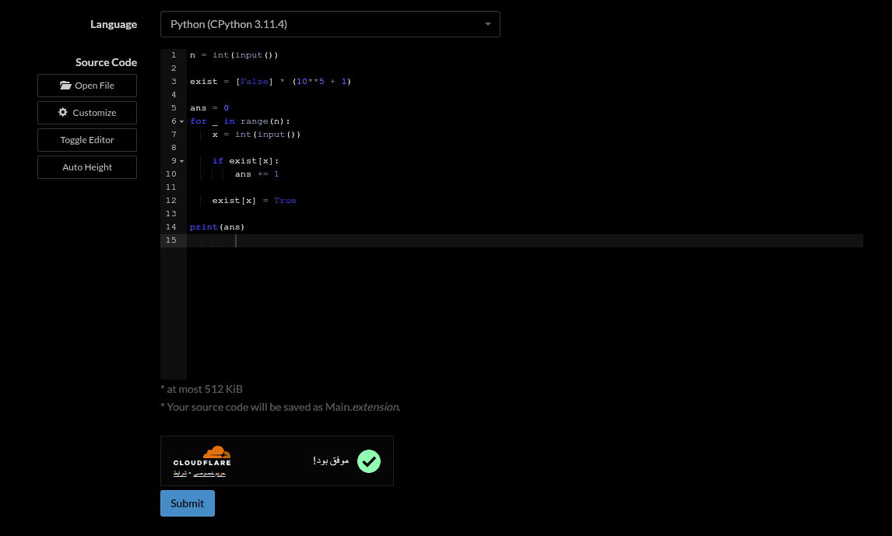
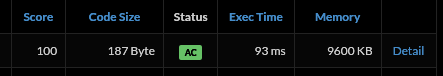
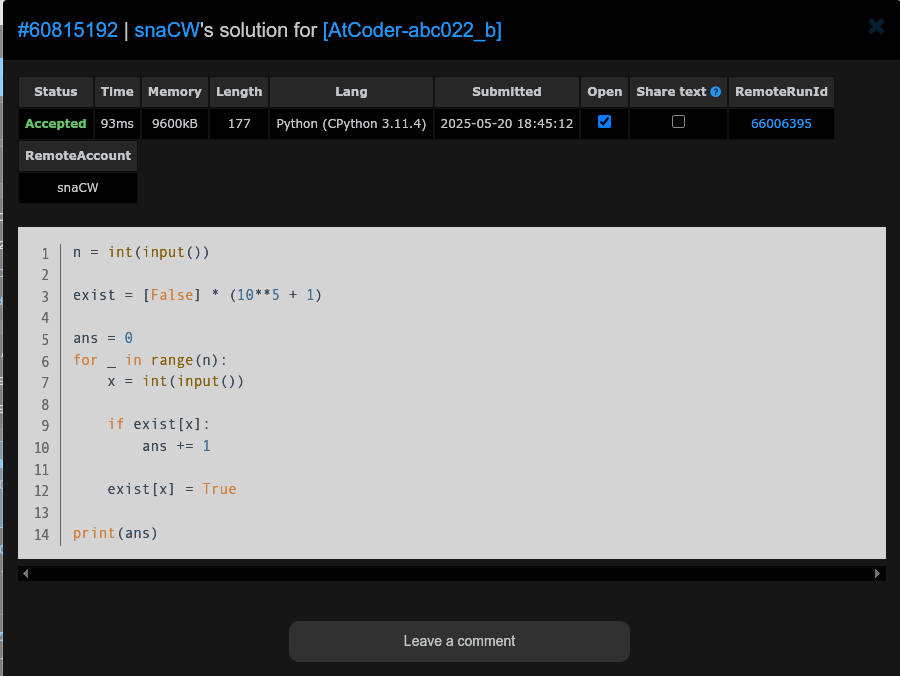

# سابمیت کد برای مسائل AtCoder

در صورتی که در سایت vjudge تلاش به ارسال کد مربوط به یک مسئله از AtCoder بکنید، با صفحه‌ی زیر مواجه می‌شوید:



***توصیه می‌شود حتماً حتماً به [مسئله‌ی مشخص‌شده در تصویر](https://vjudge.net/problem/AtCoder-abc022_b) بروید و یک بار کل این راهنما را خودتان انجام دهید!***

## اتصال اکانت AtCoder

ابتدا به سایت [AtCoder](https://atcoder.jp/) بروید. می‌توانید از لینک‌های زیر برای سهولت کار استفاده کنید:

- [AtCoder Login](https://atcoder.jp/login)
- [AtCoder Register](https://atcoder.jp/register)

یک اکانت جدید بسازید یا وارد اکانت خود بشوید.

اکنون کلید F12 را فشار داده تا وارد بخش Inspect شوید. وارد بخش Application شوید. اگر آن را پیدا نمی‌کنید به بالای صفحه نگاه کنید. در مرورگر فایرفاکس به‌دنبال Storage باشید.

در منوی سمت چپ این بخش، بخش Cookies را باز کنید.



همان‌طور که مشاهده می‌کنید به این آدرس رفتیم:

```
Cookies > https://atcoder.jp > REVEL_SESSION
```

باید مقدار این کوکی را کپی کنید.

***هشدار: مقدار این کوکی را با کسی به اشتراک نگذارید!!!***

به صفحه‌ی سابمیت برمی‌گردیم.


بر روی گزینه‌ی Update کلیک کنید و در فیلد مشخص‌شده، مقدار کوکی را بگذارید. **با این کار، سایت vjudge می‌تواند وارد اکانت شما شده و سابمیت‌های شما را رصد کند. سایت vjudge امن است و هیچ خطری ایجاد نمی‌کند.**

پس از اینکه سایت vjudge کوکی لاگین شما را دریافت کرد، صفحه‌ی سابمیت به‌شکل زیر درمی‌آید:



اکانت شما با موفقیت متصل شد!

## سابمیت کد

به همان عکس بالا نگاه کنید، ۳ خط توضیحات را مشاهده می‌کنید:

- Please submit at ...
- Submissions from ...
- More tips

در خط اول، یک لینکی برای شما ارائه شده است. بر روی آن کلیک کنید تا به سایت AtCoder بروید. پس از باز شدن مسئله، به پایین صفحه بروید و کد خود را سابمیت کنید:

```py
n = int(input())

exist = [False] * (10**5 + 1)

ans = 0
for _ in range(n):
    x = int(input())

    if exist[x]:
        ans += 1

    exist[x] = True

print(ans)
```



در صورتی که کد شما درست باشد، پذیرفته می‌شود:



کد شما پذیرفته شد!

## مطلع کردن vjudge

ما در سایت vjudge هنوز در منوی سابمیت هستیم:


تنها کافی است بر روی گزینه‌ی سابمیت کلیک کنید. vjudge وارد اکانت شما می‌شود و وضعیت سابمیت شما را بررسی می‌کند. در صورتی که سابمیت شما پذیرفته‌شده باشد، vjudge نیز از شما می‌پذیرد.

