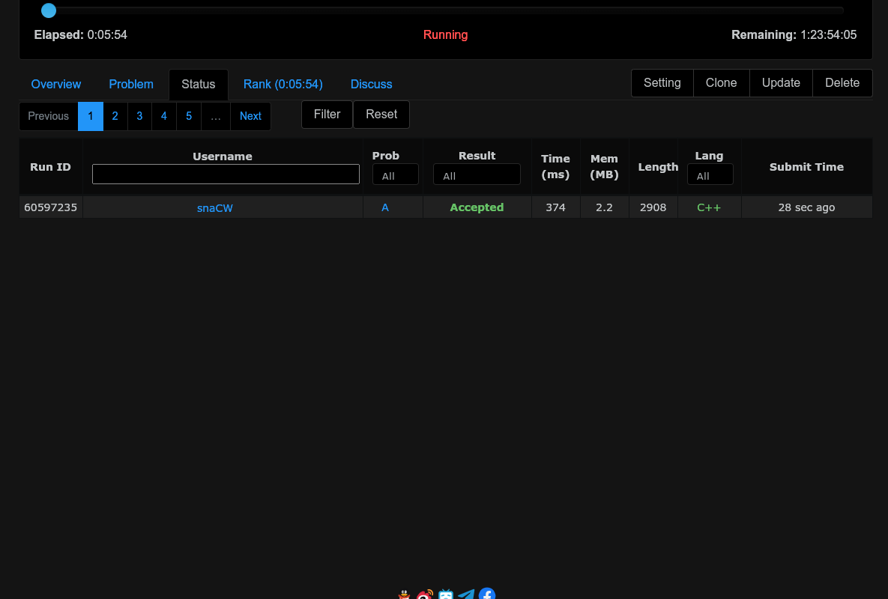

# شروع به کار با Vjudge

سایت vjudge.net به ما امکان برگزاری مسابقات برنامه‌نویسی را می‌دهد.

## فهرست

- [ثبت نام](#ثبت-نام)
- [ورود به گروه IAUMCPC](#ورود-به-گروه-iaumcpc)

## ثبت نام

ابتدا به سایت [vjudge](https://vjudge.net/) بروید و در قسمت بالا سمت راست صفحه، بر روی Register کلیک کنید.

فیلدهای لازم (که با ستاره نمایش داده شده اند) را پر کنید.

## ورود به گروه IAUMCPC

از آن‌جایی که گروه IAUMCPC یک گروه private است، شما ابتدا باید نام کاربری خود را برای یکی از ادمین‌های گروه بفرستید تا تأیید بشوید.

برای تأیید شدن باید حتماً دو مورد زیر را بفرستید:

- نام کاربری
- نام و نام خانوادگی

می‌توانید اطلاعات بالا را برای من با آی‌دی [‎@Ashrafi00011](https://t.me/Ashrafi00011) در تلگرام بفرستید.

پس از تأیید شدن، می‌توانید به [گروه IAUMCPC](https://vjudge.net/group/iaumcpc) بروید.

## شرکت در مسابقه

### پیش از شروع مسابقه

در زمان مشخصی که برای یک مسابقه اعلام می‌شود، به لینک اعلام‌شده بروید. در پیش از شروع مسابقه، صفحه‌ی زیر را مشاهده خواهید کرد:

تایم شروع و پایان مسابقه و زمان باقی‌مانده تا شروع مسابقه برای شما نمایش داده می‌شود، اما سؤالات (طبیعتاً) در دسترس شما قرار نمی‌گیرد.

### مسابقه

هنگامی که شمارش معکوس به صفر برسد، سایت خودکار reload می‌شود تا سؤالات در دسترس شما قرار گیرد.

- فیلد Elapsed میزان زمان طی‌شده از شروع مسابقه را نشان می‌دهد.
- فیلد Remaining میزان زمان باقی‌مانده تا پایان مسابقه را نمایش می‌دهد.

در بخش Overview، سؤالات مسابقه برای شما فهرست می‌شوند. با رفتن به بخش Problem می‌توانید متن سؤالات را بخوانید.

### ترجمه‌ی متن مسئله

گاهی اوقات ممکن است خواندن زبان انگلیسی سخت باشد که می‌تواند از پایین سمت چپ، به نسخه‌های دیگر سؤال دسترسی پیدا کنید. برای مثال بر روی DeepSeek_zh کلیک می‌کنیم:

به همین راحتی به ترجمه‌ی چینی این مسئله دست پیدا کردیم. در مسابقاتی که برگزار می‌شود، حتماً متن فارسی در کنار متن انگلیسی در اختیار شما قرار می‌گیرد.

### ارائه‌ی کد

پس از نوشتن کد مرتبط با مسئله، بر روی گزینه‌ی Submit کلیک کنید تا منوی زیر بیاید:

در فیلد Solution باید کد خود را کپی کنید.

در فیلد Language زبان کد خود را می‌توانید انتخاب کنید. پیشنهاد ما استفاده از دو مورد زیر است:

- GNU G++17 7.3.0
- Python 3.13.2

زبان‌های C++‎ و Python در مسابقات استاندارد ICPC بیش‌تر استفاده می‌شوند. تضمین می‌شود که راه حل تمام مسئله‌ها با زبان C++‎ پذیرفته می‌شود اما چنین تضمینی برای Python نیست.

پس از انتخاب زبان مورد نظر، بر روی Submit کلیک کنید.

در صورتی که کد شما درست باشد، متن سبز Accepted برای شما می‌آید.

### وضعیت مسابقه‌دهنده

در حین برگزاری مسابقه، می‌توانید وضعیت سابمیت‌های گذشته و جایگاه خود بین تمام شرکت‌کننده‌ها را ببینید.

